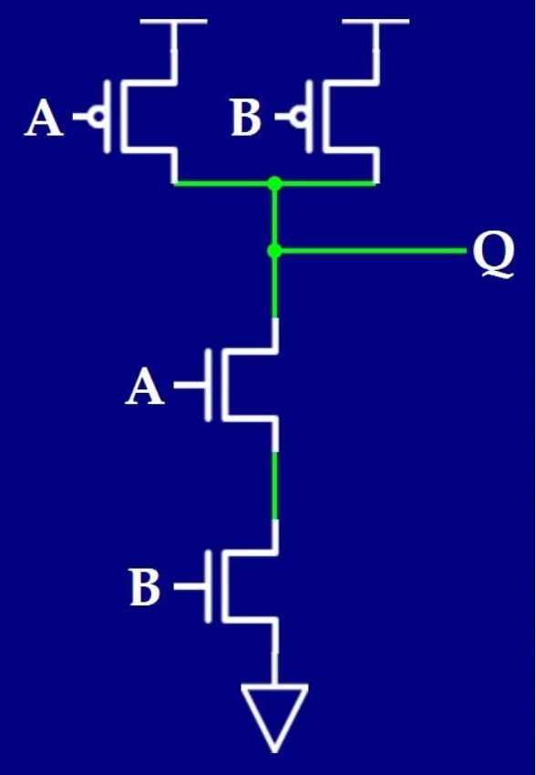
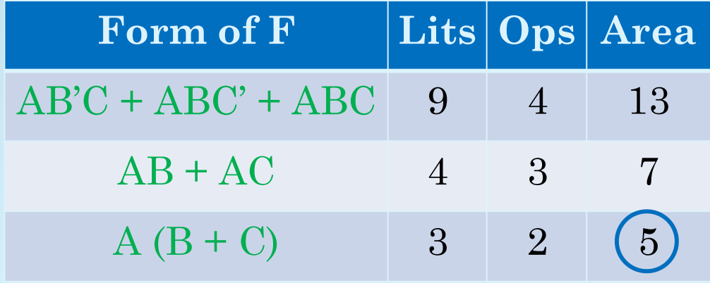

# Digital Device(电路元件)

## MOSFET(晶体管)

（L9 p0-32）

## Heuristics Methods （启发式方法判断逻辑表达式的优劣）
（not very important -- at least I think it won't be included in the exam）

已知三个逻辑表达式等价，F = ABC + ABC' + AB'C = AC + AB = A(B+C)，具体证明可以用boolean的运算法则，也可以绘制真值表，那么在设计电路的时候应该如何选择这三种表达式呢？

首先要确定Metrics（即，我们衡量好坏的指标 e.g 电路响应时间越短越好？使用的逻辑门越少越好？）在确定了指标的前提下，想要去判断好坏，第一种简单的想法就是，我实际把电路搭出来，测试一下好坏。但是当我的系统非常复杂的时候，逻辑表达式非常复杂，实际搭出电路可能耗时费力花钱。所以我们希望使用一种启发式的方法，这种方法的满足

- 1.与实际测量单调，即用启发式方法得出x1 < x2，在实际测量的时候 x1 < x2 
- 2.数值相对准确

e.g1:以电路占用的空间为metric

启发式方法：以literals（字母，A和A'算两个不同的）的总数 + operators（逻辑运算的算子，AND OR）的总数

原理：

- 一个literals对应两个输入端口（即，两个晶体管），如下图1，一个NAND门，AB两个输入，A输入会连接到一个p-type CMOS和一个n-type CMOS
- 一个复合operators会对应两个输入端口（即，两个晶体管），F = ABC + ABC' + AB'C，三个AND要经过一个OR，每个AND需要两个输入口，如下图2，一个三输入NAND门，ABC三个输入端口，分别可能输入ABC,ABC',AB'C
- 综合起来，这种启发式方法大致估计了晶体管的个数，大致代表了电路占据空间的多少

{: style="float: left; width: 45%;" }
{: style="float: right; width: 45%;" }

{: style="float: right; width: 45%;" }

如右图，启发式方法得到的area大小分析。

F = ABC + ABC' + AB'C 总共有9个literals（字母是重复计数的，比如A被计算了三次，联系一下上面的literals对应两个晶体管，可以理解为什么是重复计数的），4个operators（3个AND 1个OR ---OR是三输入的OR）

F = AC + AB总共有4个literals，3个operators（2个AND，一个OR）

e.g2:以电路运行的时间为metric

启发式方法：以从输入到输出要经过逻辑门的总数来计算

原理：逻辑门的开关需要时间，经过的逻辑门越多，响应时间越慢

如果是多指标的判断可以考虑帕累托曲线（Pareto Curve）
